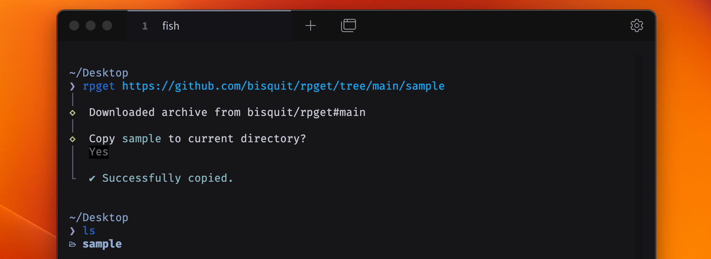

<div align="center">
  
</div>

# rpget

<a href="https://www.npmjs.com/package/rpget"></a>
[](https://github.com/bisquit/rpget/actions/workflows/ci.yml)

Download directory or files from a repository URL you are viewing.

## Requirements

**Github CLI must be installed and authenticated.**

## Limitations

- Only Github is supported
- Only Mac is supported

## Install

```sh
npm i -g rpget
```

```sh
yarn global add rpget
```

```sh
pnpm add -g rpget
```

## Usage

Hit `rpget <url>`.

```sh
# directory
rpget https://github.com/bisquit/rpget/tree/main/sample

# file
rpget https://github.com/bisquit/rpget/blob/main/sample/README.md

# tag, commits
rpget https://github.com/bisquit/rpget/tree/v0.0.1/sample
rpget https://github.com/bisquit/rpget/tree/9541f14414f10a7d7a2789f529dce6d4bebeaa42/sample
```

You can also download overall repo. (It practically equals to "Download ZIP", unzip it, and move to current directory)

```sh
rpget https://github.com/bisquit/rpget
```

## How it works

This tool downloads archive in temp directory using `gh api`, and 
after user confirmed, decompresses it and copies into current directory.

Because branches can include `/`, we cannot distinguish the URL `main/src` between:
- a) `main/src` branch
- b) `main` branch and `src` directory

So this tool attempts to fetch archive with "possible refs" concurrently.
It's much faster than checking with `git fetch` or `git clone`.

## Comparison

This tool is initialy inspired by

- https://github.com/Rich-Harris/degit
- https://github.com/unjs/giget

While these are primarily intended for **scaffolding from nothing**, this tool is intended for **copying into existing code**.

Also, because of its use case, aimed to easily download partial directory, not the whole repository.
